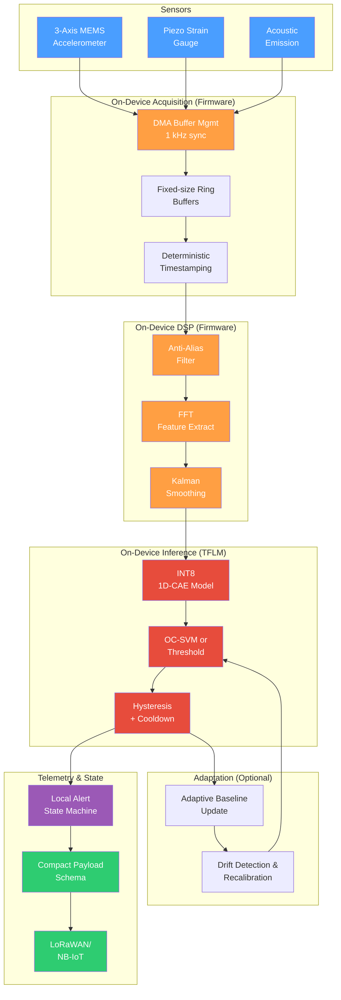
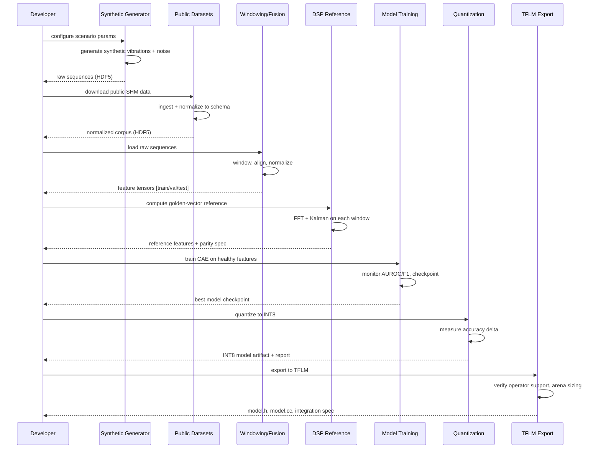
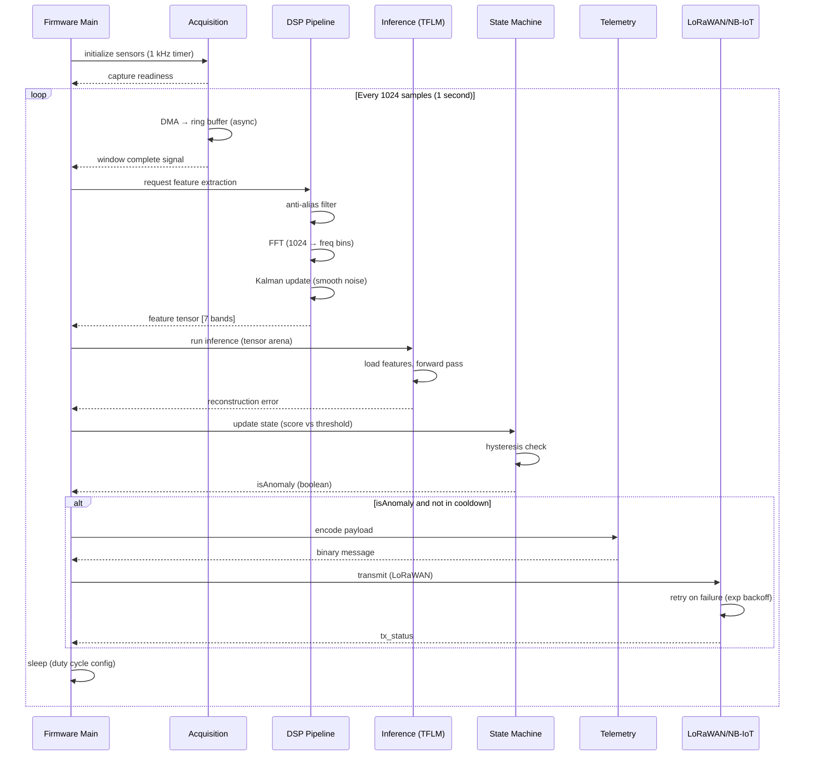
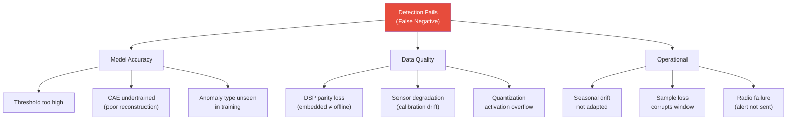
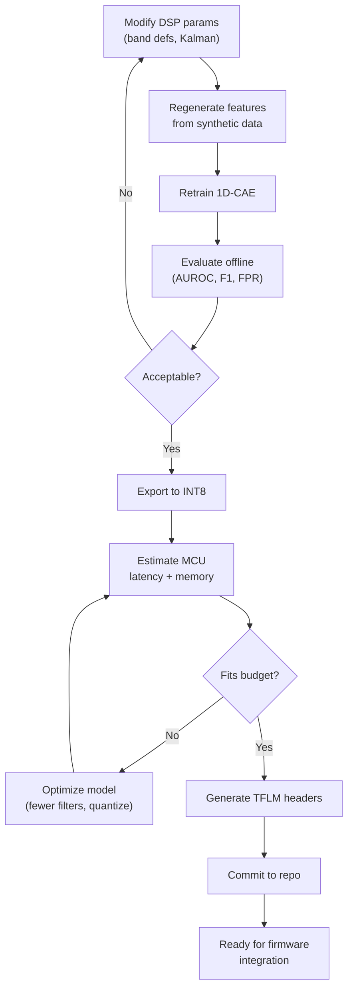
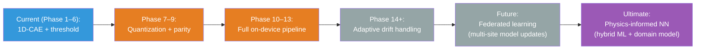

# EdgeSeisFusion — Technical Architecture

> **Version:** 0.1.0  
> **Last updated:** 2026-04-19  
> **Runtime:** Sony Spresense (ARM Cortex-M4F, 1.5 MB SRAM)  
> **Language:** Embedded C/C++ · Python (offline only)  
> **Architecture style:** Extreme-edge multi-modal sensor fusion with on-device anomaly detection  

---

## Table of Contents

1. [System Overview](#1-system-overview)
2. [Architecture Breakdown](#2-architecture-breakdown)
3. [Domain Model](#3-domain-model)
4. [Execution Flow](#4-execution-flow)
5. [Hardware & Memory Constraints](#5-hardware--memory-constraints)
6. [Key Design Decisions](#6-key-design-decisions)
7. [Data Pipeline & DSP](#7-data-pipeline--dsp)
8. [Failure & Edge Case Analysis](#8-failure--edge-case-analysis)
9. [Security & Privacy](#9-security--privacy)
10. [Developer Onboarding Guide](#10-developer-onboarding-guide)
11. [Offline Development Workflow](#11-offline-development-workflow)
12. [Suggested Improvements](#12-suggested-improvements)

---

## 1. System Overview

### Purpose

EdgeSeisFusion is a **decentralized, extreme-edge framework for autonomous structural health monitoring** designed for aging Japanese civil infrastructure (bridges, tunnels, expressways). It fuses multi-modal sensor data entirely on-device using Sony Spresense, enabling years-long autonomous operation on battery/solar power with **zero raw vibration data transmission**.

The system detects seismic degradation through:
- **Local FFT-based feature extraction** from synchronized 1 kHz multi-modal streams
- **1D Convolutional Autoencoder (1D-CAE)** for anomaly detection trained on healthy baselines
- **Kalman filtering** for noise smoothing and drift compensation
- **INT8 quantization** for memory efficiency under 1.5 MB SRAM constraints
- **LoRaWAN/NB-IoT metadata-only transmission** of anomalous events with context

### High-Level Architecture



### Core Responsibilities

| Layer | Responsibility | Implementation |
|---|---|---|
| **Sensor Acquisition** | Deterministic multi-modal capture at 1 kHz, DMA buffering, sample-loss tracking | Spresense SDK, hardware timers |
| **DSP Pipeline** | Anti-alias filtering, FFT extraction, Kalman smoothing, feature normalization | Embedded C/C++, CMSIS-DSP |
| **Model Inference** | INT8 quantized 1D-CAE execution, reconstruction scoring, OC-SVM if fitted | TensorFlow Lite for Microcontrollers (TFLM) |
| **Decision Logic** | Anomaly thresholding, hysteresis, state machine, cooldown management | Firmware state machine |
| **Adaptation (Phase 14+)** | Conservative baseline drift tracking, threshold recalibration guardrails | Bounded on-device update logic |
| **Telemetry** | Compact payload encoding, alert transmission, retry policy | LoRaWAN/NB-IoT driver |
| **Power Management** | Duty cycle scheduling, sleep states, wake-on-interrupt logic | Spresense power control |

---

## 2. Architecture Breakdown

### Offline Development Stack (Python)

#### Synthetic Signal Generator (`models/synthetic_gen.py`)
Generates reproducible multi-modal vibration sequences simulating:
- Mass-spring-damper dynamics (healthy bridge baseline)
- Thermal drift (seasonal ±5°C → 0.5–2% frequency shifts)
- Traffic-induced variations (load patterns, frequency modulation)
- Degradation scenarios (micro-fractures, joint slippage)
- Rare anomaly events (seismic transients, impact)

Output: Raw sensor sequences at 1 kHz with scenario manifests and ground truth labels.

#### Public Dataset Ingestion (`datasets/loader.py`)
Ingests and normalizes public SHM datasets (Mendeley, Zenodo):
- Schema alignment (accelerometer channels, sampling rate, units)
- Resampling to canonical 1 kHz
- Provenance tracking (dataset source, license, date)
- Non-IID splits (by structure/site, not random row)

Output: Normalized offline corpus with metadata, split bundles for train/validation/test.

#### DSP Reference Pipeline (`dsp/reference_dsp.py`)
Locked offline versions of embedded DSP stages:
- Anti-alias filter specification and verification
- FFT parameters (window type, overlap, normalization)
- Kalman filter initialization and tuning (noise covariance, process model)
- Feature extraction (band energies, spectral moments)
- Output signatures and per-stage timing/memory estimates

Output: Tested DSP module with golden-vector test suite for parity validation.

#### Windowing & Fusion (`preprocessing/windowing.py`)
Converts raw streams into fixed-shape, model-ready tensors:
- Synchronized multi-channel windowing (1024 samples = 1 second @ 1 kHz)
- Overlap policy (50%, sliding windows for drift detection)
- Channel alignment and feature normalization (zero-mean, unit variance)
- Split rules by structure/site (prevents fake generalization)
- Export of train/validation/test feature packs

Output: Canonical feature tensors, split metadata, loader utilities.

#### Model Training Pipeline (`models/train_cae.py`)
Trains compact 1D-CAE on reference feature tensors:
- Architecture: 1D convolutions (32→16→8 filters, kernel=3)
- Training: Reconstruction loss on healthy-only or mostly-healthy data
- Checkpointing: Size-constrained candidates (target <50 KB quantized)
- Metrics: AUROC, F1, false-positive rate under drift
- Quantization: Post-training INT8 conversion with accuracy validation

Output: Best baseline model checkpoint, training report, quantized INT8 artifact.

#### Anomaly Decision Layer (`models/anomaly_scorer.py`)
Evaluates thresholding + hysteresis + optional OC-SVM:
- Reconstruction error statistics (μ, σ) on healthy baseline
- Threshold selection: fixed (μ + 2σ) vs. learned (OC-SVM)
- Hysteresis logic: up-threshold vs. down-threshold to avoid chatter
- Offline evaluation plots (ROC, precision-recall, confusion matrix)

Output: Frozen anomaly scoring spec, threshold parameters, offline evaluation.

#### Model Export Pipeline (`models/export_tflm.py`)
Produces MCU-ready inference bundles:
- INT8 model conversion to TensorFlow Lite format
- TFLM header/blob generation (model.h, model.cc)
- Tensor arena sizing estimation
- Operator compatibility verification (Conv1D, MaxPool, supported)
- Integration checklist (arena alignment, inference loop template)

Output: TFLM package (model binary, headers, arena config, operator list).

### On-Device Firmware (C/C++)

#### Sensor Acquisition Module (`firmware/acquisition.cpp`)
Brings up deterministic on-device data capture:
- Multi-channel sensor initialization (I2C/SPI protocol stack)
- DMA buffer management (double-buffering for seamless streaming)
- Fixed-size ring buffers (prevent overruns, track sample loss)
- Deterministic timestamping (hardware timer with jitter < 1 µs)
- Diagnostic counters (samples dropped, buffer resets, sensor errors)

Output: Raw timestamped windows, validated capture diagnostics.

#### DSP Integration Module (`firmware/dsp_embedded.cpp`)
Ports offline DSP to embedded C/C++:
- Anti-alias FIR filter (pre-computed coefficients)
- FFT execution (uses CMSIS-DSP or KISS-FFT for Cortex-M4)
- Kalman filter (state update, noise adaptation)
- Feature extraction (band energies, RMS normalization)
- Golden-vector regression tests against offline reference

Output: Edge feature tensors, parity reports, per-window latency/memory profiling.

#### TFLM Inference Engine (`firmware/inference.cpp`)
Integrates the exported INT8 model:
- Model loading and tensor arena initialization
- Per-window inference execution
- Reconstruction error computation
- Operator performance telemetry

Output: Inference results, latency measurements, arena utilization stats.

#### Anomaly Decision State Machine (`firmware/anomaly_state_machine.cpp`)
Implements production-grade alert logic:
- Threshold-based or OC-SVM scoring (frozen at deployment)
- Hysteresis to prevent false-positive chatter
- Cooldown logic (minimum time between consecutive alerts)
- State tracking (last alert timestamp, alert count/window)
- Confidence metrics (anomaly score, sensor health flags)

Output: Boolean anomaly decisions, confidence scores, alert state.

#### Telemetry Payload Encoder (`firmware/telemetry.cpp`)
Encodes compact uplink messages:
- Alert schema: anomaly score (uint8), confidence band (uint8), sensor flags (uint16), context (compressed)
- Device metadata: battery voltage, temperature, sample loss count, uptime
- Compression: JSON to binary encoding (saves 60–70% vs. raw JSON)
- Retry policy: exponential backoff on transmission failure

Output: Binary uplink messages, bytes-per-alert metrics.

#### Main Firmware Loop (`firmware/main.cpp`)
Orchestrates the full pipeline:
1. Initialize sensors and DSP
2. Load quantized model into tensor arena
3. Infinite loop:
   - Wait for full window in ring buffer
   - Extract features via DSP pipeline
   - Run inference on tensor arena
   - Compute anomaly score
   - Update state machine
   - If alert: encode payload and transmit
   - If not: sleep and return to 1
4. Graceful error recovery (watchdog, sample-loss logging)

---

## 3. Domain Model

### Key Data Structures

#### RawSensorFrame
```
Timestamp (nanosecond precision)
Acceleration[3] (mg, signed int16 after normalization)
Strain (mV, unsigned int16)
Acoustic (dB, unsigned int16)
SampleLossCount (diagnostic uint8)
```

#### FeatureTensor (Canonical Shape)
```
Shape: [1024, 7]  // 1 second @ 1 kHz, 7 frequency bands per channel
[Accel-X bands, Accel-Y bands, Accel-Z bands, Strain bands, Acoustic bands]
Normalized: zero-mean, unit variance per channel
Dtype: float32 (offline) → int8 (quantized on-device)
```

#### AnomalyScore
```
Score: float (reconstruction error or OC-SVM distance)
Threshold: float (frozen from training)
Confidence: float (0.0 – 1.0, based on distance from decision boundary)
SensorHealthFlags: bitfield
  - bit 0: accelerometer valid
  - bit 1: strain gauge valid
  - bit 2: acoustic valid
  - bit 3: DMA overrun detected
  - bit 4: sample loss detected
IsAnomaly: boolean (after hysteresis + threshold)
```

#### TelemetryPayload
```
AlertTimestamp (unix seconds, uint32)
AnomalyScore (uint8, compressed 0–255)
ConfidenceBand (uint8, 0–255)
SensorHealth (uint16, bitfield)
BatteryVoltage (uint16, mV)
Temperature (int8, °C)
SampleLossCount (uint16, total dropped samples)
UptimeSeconds (uint32)
AlertCount (uint16, cumulative alerts)
```

### Offline Training Data Structures (Python)

#### SyntheticScenario
```python
@dataclass
class SyntheticScenario:
    name: str                      # "healthy_baseline", "thermal_drift_±5C", "micro_fracture"
    duration_seconds: int
    base_frequency_hz: float       # 2–10 Hz typical for bridges
    damping_ratio: float           # 0.02–0.05 (lightly damped)
    thermal_offset_celsius: float  # 0–5 K shift
    traffic_load_factor: float     # 0.8–1.2 load modulation
    noise_snr_db: float            # 30 dB typical
    anomaly_events: List[AnomalyEvent]
    ground_truth_label: int        # 0 = healthy, 1 = anomalous
```

#### HealthyBaseline
```python
@dataclass
class HealthyBaseline:
    mean_spectrum: np.ndarray      # [freq_bins], float32
    cov_spectrum: np.ndarray       # [freq_bins, freq_bins], symmetric PSD
    historical_windows: int        # N samples used to compute stats
    timestamp_frozen: str          # ISO 8601, when this baseline was locked
```

#### TrainedModel
```python
@dataclass
class TrainedModel:
    architecture: str              # "1d_cae_compact"
    weights: Dict[str, np.ndarray] # encoder + decoder weights
    quantization_params: Dict      # scale, zero_point per layer
    auroc_validation: float
    f1_validation: float
    false_positive_rate_at_threshold: Dict[float, float]
    model_size_bytes: int
    inference_latency_ms: float    # estimated on Spresense
```

---

## 4. Execution Flow

### Offline Phase (Months 1–3, Laptop/Desktop GPU)



### On-Device Phase (Months 2–4, Spresense Board)



### Per-Window Timing Budget (Phase 10–12)

| Stage | Target (ms) | Hardware | Notes |
|---|---|---|---|
| **DMA capture** | 1024 (async, doesn't block) | Hardware timer | Deterministic, 1 kHz sampling |
| **Feature extraction (DSP)** | 50–100 | CMSIS-DSP on M4 | FFT + Kalman, parallelizable |
| **Inference (TFLM)** | 200–300 | Cortex-M4F | INT8 ops, quantization speedup |
| **Anomaly scoring** | 5–10 | Pure C | Threshold + hysteresis |
| **Payload encoding** | 1–2 | Pure C | Simple binary pack |
| **Radio transmission** | 100–500 | Radio driver | LoRaWAN: ~100ms for 20 bytes |
| **Total per-window active time** | ~400 ms | | Leaves 600 ms for sleep/duty cycle |

---

## 5. Hardware & Memory Constraints

### Spresense Resource Envelope

| Resource | Limit | Allocated To | Notes |
|---|---|---|---|
| **SRAM** | 1.5 MB | Acquisition buffers (ring): 200 KB, DSP workspace: 100 KB, Tensor arena: 600 KB, Inference scratch: 300 KB, State + allocator: 200 KB | Nearly fully subscribed; no room for multiple models |
| **Flash** | 2 MB | Firmware binary: 800 KB, Model weights (INT8 1D-CAE): 50–80 KB, Config/strings: 50 KB, Bootloader: 100 KB | Sufficient for single model; model swapping not feasible |
| **CPU** | ARM Cortex-M4F @ 156 MHz | DSP (FFT), inference (TFLM), I/O | Single-threaded; no pre-emption during inference |
| **Power budget** | 20–50 mW active, <1 mW sleep | Sensing, DSP, radio bursts | Years on AA batteries with duty cycle <1% |
| **Duty cycle** | <1% | Active time per cycle | Implies: capture + DSP + inference + transmission ≤ 30 sec per 60 min |

### Memory Layout (Conceptual)

```
0x00000000 ┌─────────────────────────┐
           │  Bootloader (100 KB)    │
           ├─────────────────────────┤
0x00019000 │  Firmware Code (800 KB) │
           ├─────────────────────────┤
0x000D9000 │  Model Weights (80 KB)  │
           ├─────────────────────────┤
0x000ED000 │  Config Strings (50 KB) │
           └─────────────────────────┘ (Flash limit)

0x20000000 ┌─────────────────────────┐ (SRAM start)
           │ Ring Buffer (200 KB)    │ (Acquisition)
0x20032000 ├─────────────────────────┤
           │ DSP Workspace (100 KB)  │ (FFT, Kalman)
0x20049000 ├─────────────────────────┤
           │ Tensor Arena (600 KB)   │ (TFLM model + activations)
0x200CD000 ├─────────────────────────┤
           │ Inference Scratch (300)  │ (Temporaries, output buffers)
0x200D9000 ├─────────────────────────┤
           │ State + Alloc (200 KB)  │ (Global vars, heap)
0x200E5800 └─────────────────────────┘ (SRAM limit)
```

### Power Profiling Targets

| Component | Active (mA) | Sleep (mA) | Typical Duty |
|---|---|---|---|
| **MCU core (Cortex-M4F)** | 10 | 0.01 | 30 sec active / 60 min cycle |
| **Sensors (accel + strain + acoustic)** | 5 | 0.5 | Always on (low-power sleep mode) |
| **Radio (LoRaWAN TX burst)** | 30 | 0.01 | ~1 alert per hour (20 sec TX setup) |
| **Total system** | 45 | 0.5 | <1% duty → multi-year on batteries |

---

## 6. Key Design Decisions

### Why This Architecture

1. **Extreme-edge, no cloud dependency**
   - *Rationale:* Japanese disaster resilience + APPI compliance; no reliance on WAN/backhaul
   - *Trade-off:* All computation and anomaly logic must fit on MCU; no real-time cloud retraining

2. **1D-CAE + threshold over supervised multi-class**
   - *Rationale:* Structural failure is rare; anomaly detection (one-class) is better suited than classification. Reconstruction loss directly captures deviation from healthy baseline.
   - *Trade-off:* Cannot distinguish *types* of anomalies; only detects presence.

3. **Kalman filtering over raw FFT bins**
   - *Rationale:* Bridges exhibit continuous motion (traffic, wind). Kalman smooths sensor noise and provides trend estimate for drift adaptation.
   - *Trade-off:* Adds state management; requires tuning of process/measurement noise covariance.

4. **INT8 quantization (aggressive compression)**
   - *Rationale:* Model must fit in <50 KB of flash; inference must run in tensor arena within 600 KB SRAM.
   - *Trade-off:* Accuracy loss (typically 1–5% AUROC drop); requires careful validation.

5. **LoRaWAN metadata-only (no raw data)**
   - *Rationale:* Bandwidth severely constrained (4.8 kbps typical LoRaWAN, disaster scenarios even worse). Anomaly *score* + *context* sufficient for remote monitoring.
   - *Trade-off:* Cannot replay raw signals; root-cause analysis done post-facto if model recalibration needed.

6. **Fixed window size (1024 samples = 1 sec) over adaptive windowing**
   - *Rationale:* Simplifies DSP pipeline, enables deterministic latency, aligns with 1 kHz canonical rate across all datasets.
   - *Trade-off:* May miss very-long-period anomalies (hours–days drift); Phase 14 adaptive baseline addresses this.

7. **Ring buffers + DMA over event-driven sampling**
   - *Rationale:* Eliminates jitter in multi-modal capture; prevents missed samples under interrupt latency.
   - *Trade-off:* Fixed memory footprint (200 KB ring), but no dynamic resizing.

### Observability & Diagnostics

| Observable | Collection Method | Purpose |
|---|---|---|
| **Per-window latency** | Hardware timer ticks | Identify bottleneck stages (DSP vs. inference vs. radio) |
| **Tensor arena utilization** | TFLM interpreter state | Ensure no overflow; validate memory budget before deployment |
| **Reconstruction error distribution** | Histogram over sliding window | Detect baseline drift or model degradation |
| **Sample loss count** | DMA/ring buffer counter | Alert to acquisition jitter or overruns |
| **Radio TX success rate** | Retry counter + ACK tracking | Assess network reliability in field |
| **Temperature & battery** | ADC readings | Inform sleep schedule; flag degradation |
| **Alert rate (false positive baseline)** | Event counter in healthy periods | Validate threshold tuning; compare offline vs. field |

---

## 7. Data Pipeline & DSP

### Canonical Sensor Schema (1 kHz Multi-Modal)

```
Channel 0: Acceleration-X (milli-g, ±2000 range typical)
Channel 1: Acceleration-Y (milli-g, ±2000 range typical)
Channel 2: Acceleration-Z (milli-g, ±2000 range typical)
Channel 3: Strain Gauge (milli-volt, 0–5V range)
Channel 4: Acoustic Emission (dB, 0–120 dB range)
```

All channels synchronized to nanosecond precision via hardware timestamp counter.

### DSP Reference Pipeline (Locked Phase 5)

```
INPUT: 1024 raw samples @ 1 kHz (1 second window)

Stage 1: Anti-Alias Filter
  - Type: FIR lowpass, 400 Hz cutoff (Nyquist = 500 Hz)
  - Order: 128 taps (designed offline, frozen)
  - Implementation: Direct form, linear convolution
  - Output: 1024 filtered samples, latency = 127 samples (~128 ms)

Stage 2: FFT
  - Input: 1024 filtered samples
  - Type: Radix-2 FFT (zero-padded to 2048 for symmetry)
  - Output: 1024 complex bins (DC to Nyquist)
  
Stage 3: Power Spectrum
  - Magnitude squared, normalized by bin count
  - Shape: [1024] floats
  
Stage 4: Band Aggregation (7 frequency bands)
  - Band 1: 0–10 Hz (very low freq, structure mode)
  - Band 2: 10–20 Hz (first fundamental freq range)
  - Band 3: 20–50 Hz (2nd, 3rd harmonics)
  - Band 4: 50–100 Hz (higher modes)
  - Band 5: 100–150 Hz (sensor-limited range)
  - Band 6: 150–250 Hz (acoustic range, strain transients)
  - Band 7: 250–500 Hz (high-frequency noise floor)
  - Output: [7] floats per channel → [5 channels, 7 bands] = 35 features

Stage 5: Kalman Filtering (per-band)
  - State: [mean, variance] per band
  - Measurement: current band energy
  - Noise model: tuned on healthy baseline (σ²_process ≈ 0.01, σ²_meas ≈ 0.05)
  - Output: Smoothed estimates [5 channels, 7 bands] = 35 floats

Stage 6: Normalization
  - Z-score per channel (subtract mean, divide by std of last 100 windows)
  - Prevents model overfitting to raw amplitude variations
  - Output: [5 channels, 7 bands] = 35 features, zero-mean unit-variance

CANONICAL FEATURE TENSOR: [35] float32
```

### Per-Channel Feature Extraction Example

```
Accelerometer-X @ 1 kHz:
  Raw: [int16, int16, int16, ... × 1024]
  
  Anti-alias FIR:
    output[n] = sum(coeff[k] * raw[n-k]) for k in 0..127
  
  FFT(1024):
    FFT_output = rfft(filtered)  // [513] complex (DC to Nyquist)
  
  Power spectrum:
    power[i] = |FFT_output[i]|² / 1024
  
  Band aggregation:
    band_0_10Hz = mean(power[idx_0Hz : idx_10Hz])
    band_10_20Hz = mean(power[idx_10Hz : idx_20Hz])
    ... (7 bands total)
  
  Kalman update (per-band):
    predicted_mean = last_kalman_mean[band]
    residual = current_band_energy - predicted_mean
    kalman_gain = kalman_cov / (kalman_cov + measurement_noise)
    new_mean = predicted_mean + kalman_gain * residual
    new_cov = (1 - kalman_gain) * kalman_cov
  
  Normalization:
    z_score = (new_mean - channel_mean_100w) / channel_std_100w
  
  OUTPUT: 7 band features → repeat for 5 channels → 35 features total
```

### Quantization Strategy (Phase 8)

```
Float32 reference model:
  Weights: W ∈ ℝ^(weights_count)
  Activations: A ∈ ℝ^(max_activation)
  
INT8 quantization:
  Per-channel (per-filter) quantization:
    W_int8[i] = round((W[i] - W_min) / scale), scale = (W_max - W_min) / 255
    A_int8[j] = round((A[j] - A_min) / scale)
  
  During inference (dequant + op + requant):
    float_val = (int8_val - zero_point) * scale
    result_float = conv2d(...)  // computed in float
    result_int8 = round(result_float / out_scale) + out_zero_point
  
  Activation memory saved:
    Float32: 600 KB arena for activations
    INT8: ~150 KB arena (4× reduction)
    
  Trade-off:
    Accuracy loss: typically 1–3% AUROC on well-trained models
    Speed gain: ~2–3× faster due to reduced memory bandwidth
```

---

## 8. Failure & Edge Case Analysis

### Fault Tree: When Anomaly Detection Fails



### Critical Failure Modes

| Failure Mode | Symptom | Mitigation |
|---|---|---|
| **DSP parity loss** | Embedded features differ from reference by >10% | Golden-vector regression test (Phase 11), automated parity checker in firmware |
| **Quantization overflow** | INT8 activations clip (activation > 127), reconstruction error spikes | Track activation ranges during training, validate arena sizing pre-deployment |
| **Sensor calibration drift** | Baseline shifts but model not retrained | Phase 14: bounded adaptive update logic + contamination guardrails |
| **Sample loss due to DMA overrun** | Window has missing samples, FFT artifacts | Implement ring buffer overflow detection, log sample loss count, alert on persistent drops |
| **Radio transmission failure** | Alerts queued but never sent (LoRaWAN link down) | Retry with exponential backoff, log unsent alerts in flash, attempt resend on next window |
| **Model weight corruption** | Model loaded but weights garbled (flash bit flip) | CRC32 on model binary at boot, refuse inference if CRC fails, revert to safe baseline threshold |

### Edge Cases in Hysteresis State Machine

```python
# Simplified state machine pseudocode
class AnomalyStateMachine:
    def __init__(self, up_threshold=2.5, down_threshold=1.5, cooldown_sec=300):
        self.state = "HEALTHY"  # "HEALTHY" or "ANOMALY"
        self.last_alert_time = 0
        
    def update(self, anomaly_score, current_time_sec):
        if self.state == "HEALTHY":
            if anomaly_score > self.up_threshold:
                self.state = "ANOMALY"
                self.last_alert_time = current_time_sec
                return True  # ALERT
        else:  # ANOMALY
            # Prevent alert spam: require cooldown
            if current_time_sec - self.last_alert_time < self.cooldown_sec:
                return False  # suppress
            
            # Return to healthy only if score drops enough
            if anomaly_score < self.down_threshold:
                self.state = "HEALTHY"
            else:
                # Still anomalous, but only alert after cooldown
                if current_time_sec - self.last_alert_time >= self.cooldown_sec:
                    self.last_alert_time = current_time_sec
                    return True  # ALERT
        
        return False

# Edge case 1: Rapidly cycling score (2.6, 1.4, 2.7, 1.3, ...)
# Hysteresis prevents false alerts; state stabilizes
# Expected: 1 alert per cooldown period, not every jump

# Edge case 2: Sustained high score (3.5, 3.4, 3.5, 3.6, ...)
# After first alert at t=0, cooldown until t=300
# Expected: alert at t=0, next possible at t=300 (if still anomalous)

# Edge case 3: Score exactly at threshold (2.5)
# Depends on comparison operator (> vs. ≥)
# Expected: defined behavior; recommend > (strict inequality)
```

### Power Failure & Watchdog

```
Firmware setup:
  - Watchdog timer: 30 second timeout
  - Main loop must feed watchdog before each sleep
  - If inference hangs: watchdog expires, MCU resets
  
Recovery after watchdog:
  - Boot into safe mode: skip model inference, use conservative threshold
  - Log watchdog event to flash
  - Increment watchdog counter; if > 3 in 24h, disable LoRaWAN (conserve power)
  
Expected: Watchdog recovers from hang but loses telemetry for that window
```

---

## 9. Security & Privacy

### Data at Rest

| Data | Storage | Protection | Rationale |
|---|---|---|---|
| **Quantized model weights** | Flash (80 KB) | CRC32 (bit flip detect) | Model is public (published in repo); CRC prevents corruption, not secrecy |
| **Alert history (on-device)** | EEPROM (~10 KB) | None (encrypted uplink only) | Telemetry sent over LoRaWAN; alerts not stored long-term on MCU |
| **Calibration baseline** | EEPROM (~1 KB) | None | Non-sensitive; baseline is statistical property of healthy infrastructure |
| **Encryption key** | Not stored | N/A | No PII; no encryption needed. Uplink is authenticated via LoRaWAN MAC |

### Threat Model

| Threat | Mitigation | Gap |
|---|---|---|
| **Firmware tampering** | LoRaWAN network server authenticates device via IMSI/IMEI | No secure boot; physical JTAG access possible |
| **Model extraction** | Model weights are public (repository); 1D-CAE is known architecture | Model trained on private SHM datasets, but weights themselves are not sensitive |
| **False alerts (attack vector)** | LoRaWAN MAC prevents spoofed uplinks; device verifies network server | Device cannot verify alert authenticity from gateway |
| **Power analysis (side-channel)** | No hardware countermeasures | Cortex-M4 is not hardened for adversarial side-channel attacks |
| **Denial-of-service (alert spam)** | Hysteresis + cooldown logic limits alert rate to 1 per 5 min | No rate limiting on radio; attacker could inject false anomaly scores if firmware compromised |

### Privacy Considerations for Japan

- **APPI Compliance**: Alert payloads contain no PII; anomaly scores are device-internal. Only *device ID + anomaly event* transmitted.
- **Data Minimization**: Raw vibration data never leaves device; only anomaly metadata sent.
- **Localization**: All computation happens on-device; no cloud processing required.

---

## 10. Developer Onboarding Guide

### Prerequisites

**Offline (Model Training)**
- Python 3.9+
- `numpy`, `scipy`, `scikit-learn`, `tensorflow`, `librosa`
- GPU (NVIDIA CUDA preferred, but CPU works for small models)
- Docker (for reproducibility)

**On-Device (Firmware)**
- Sony Spresense SDK (v3.0+)
- ARM GCC embedded toolchain (`arm-none-eabi-gcc`)
- CMake 3.16+
- `arm-none-eabi-newlib` for C runtime
- CMSIS-DSP (bundled in SDK)

### Project Setup

**1. Clone and install offline dependencies:**
```bash
git clone <repo_url>
cd edge-seisfusion
pip install -r requirements-offline.txt
```

**2. Download/generate synthetic data (Phase 2):**
```bash
python -m datasets.synthetic_gen \
  --scenarios healthy_baseline,thermal_drift,micro_fracture \
  --output datasets/synthetic_v1.h5
```

**3. Build DSP reference pipeline (Phase 5):**
```bash
cd dsp
python reference_dsp.py --input ../datasets/synthetic_v1.h5 \
  --output ../dsp/reference_features.h5
```

**4. Train baseline model (Phase 6):**
```bash
cd models
python train_cae.py --data ../dsp/reference_features.h5 \
  --epochs 100 --model-size compact \
  --output model_checkpoint_v1.h5
```

**5. Quantize and export (Phases 8–9):**
```bash
python quantize_model.py --checkpoint model_checkpoint_v1.h5 \
  --output model_v1.tflite
python export_tflm.py --tflite model_v1.tflite \
  --output-dir ../firmware/models
```

**6. Build firmware (Phases 10+):**
```bash
cd firmware
mkdir build && cd build
cmake .. -DCMAKE_TOOLCHAIN_FILE=../spresense.cmake
make -j4
arm-none-eabi-objcopy -O binary firmware.elf firmware.bin
```

**7. Flash to Spresense:**
```bash
python spresense_tools/flash_writer.py --bin firmware.bin --port /dev/ttyUSB0
```

### Key Configuration Files

| File | Purpose | Example |
|---|---|---|
| `config/dsp_params.yaml` | FFT window, Kalman tuning, band definitions | `fft_size: 1024, kalman_process_noise: 0.01` |
| `config/model_params.yaml` | 1D-CAE architecture, quantization settings | `filters: [32, 16, 8], int8_quant: true` |
| `config/firmware_params.h` | MCU-specific: arena size, threshold, cooldown | `TENSOR_ARENA_SIZE: 614400, COOLDOWN_SEC: 300` |
| `config/deployment.yaml` | LoRaWAN credentials, uplink schema | `devaddr: 0x26041234, app_key: "..."` |

### How to Add a New Feature

**Adding a new frequency band to DSP:**
1. Update `dsp_params.yaml` with new band boundaries (Hz)
2. Modify `dsp/reference_dsp.py` `band_aggregation()` function
3. Update `preprocessing/windowing.py` to produce wider feature tensor
4. Retrain model with larger input shape
5. Validate parity with embedded DSP in Phase 11

**Adding drift adaptation (Phase 14):**
1. Implement `_update_baseline()` in `firmware/anomaly_state_machine.cpp`
2. Add adaptive threshold logic (bounded by ±10% of frozen threshold)
3. Add contamination detection (reject windows with confidence < 0.3)
4. Validate offline with drift replay test
5. Add telemetry field to report baseline version + update count

**Adding OC-SVM decision layer:**
1. Train OC-SVM on offline healthy embeddings (from 1D-CAE hidden layer)
2. Export SVM model (libsvm or similar) to C code
3. Estimate memory/latency of SVM scoring on MCU
4. If fits budget: integrate into `inference.cpp`
5. Add ablation study comparing OC-SVM vs. simple threshold

---

## 11. Offline Development Workflow

### Iterative Development Loop (Laptop/Desktop, no Hardware)



### Golden Test Suite (Regression)

Maintain a fixed replay bundle:
```
tests/golden_vectors/
├── healthy_window_001.h5        # 1024 samples × 5 channels, ground truth = HEALTHY
├── healthy_window_002.h5
├── drift_thermal_window_001.h5  # Thermal drift, still HEALTHY (no anomaly)
├── anomaly_microfracture_001.h5 # Micro-fracture, ANOMALY = true
├── anomaly_impact_001.h5        # Seismic impact, ANOMALY = true
└── anomaly_joint_failure_001.h5 # Joint failure (slippage), ANOMALY = true
```

Before any commit:
```bash
# Offline: verify DSP parity
python tests/test_dsp_parity.py --golden tests/golden_vectors/

# Offline: verify model detection
python tests/test_anomaly_detection.py --model models/model_checkpoint_v1.h5 \
  --golden tests/golden_vectors/ --threshold 2.5

# Embedded: (Phase 11+) run same golden vectors on firmware
firmware_test --vectors tests/golden_vectors/ --threshold 2.5
```

---

## 12. Suggested Improvements

### Critical (Correctness)

| Issue | Risk | Fix | Timeline |
|---|---|---|---|
| **No bit-error resilience** | Single bit flip in model weights → silent inference error | Add CRC32 to model binary, verify at boot, revert to safe threshold if corrupted | Phase 16 reliability demo |
| **Kalman filter not validated** | Noise covariance tuned on synthetic data; may diverge on real infrastructure | Collect real sensor traces, validate Kalman convergence on actual bridges | Post-Phase 6 before deployment |
| **Quantization validation incomplete** | INT8 activations may overflow on edge cases | Implement runtime activation range checking; log min/max per window; trigger recalibration if > 127 | Phase 8 |

### High (Reliability)

| Issue | Risk | Fix |
|---|---|---|
| **No anomaly score saturation** | Score accumulates unboundedly (doesn't cap at 255); older alerts harder to interpret | Implement saturating arithmetic (min(score, 255)) in anomaly scoring |
| **Hysteresis state machine has no persistence** | Power loss while anomalous → state lost → may miss follow-up alerts | Persist state to EEPROM (2 bytes: state + last_alert_time_low16) |
| **Ring buffer underflow on sample loss** | If DMA starves, feature extraction reads stale data | Add watermark check before DSP; skip frame if data too old |
| **No sensor health monitoring** | Strain gauge or accelerometer failure not detected | Track variance per sensor; alert if variance < threshold for 100 windows |

### Medium (Operational)

| Issue | Impact | Fix |
|---|---|---|
| **No over-the-air model update** | Deploying new models requires physical access | Design firmware update mechanism (LoRaWAN gateway → device) |
| **No long-term trend visualization** | Can't see multi-month baseline shifts | Store rolling 7-day baseline statistics in EEPROM, expose via LoRaWAN telemetry |
| **Power consumption not validated on real hardware** | Lab measurements may differ from field (radio environment, sensor power) | Phase 15: deploy to real bridge, measure actual current draw for 24h+ |
| **No fallback if Kalman diverges** | Smoothing suddenly fails; reconstructions become unreliable | Implement "emergency reset": if innovation > 3σ, reset Kalman state to identity |

### Low (Code Quality)

| Issue | Impact | Fix |
|---|---|---|
| **Magic numbers in DSP params** | 400 Hz cutoff, 0.01 process noise not justified in code | Document in `dsp_params.yaml` with rationale (e.g., "400 Hz chosen for 2–5 Hz structural modes") |
| **No firmware profiling instrumentation** | Can't identify slow functions in field | Add optional `ENABLE_PROFILING` flag; log cycle count per stage (DSP, inference, etc.) |
| **Test coverage sparse** | Regression risk when refactoring DSP or state machine | Add unit tests for: Kalman update, band aggregation, hysteresis transitions, quantization |

### Architecture Evolution Path



---

## Appendix: Project Structure Reference

```
edge-seisfusion/
├── plan.txt                          # 16-phase execution plan
├── README.md                         # High-level overview
├── ARCHITECTURE.md                   # This document
│
├── contracts/                        # Machine-readable specifications (versioned)
│   ├── resource_budget_contract.v1.json
│   └── tech_stack_profile.v1.json
│
├── docs/                             # Phase deliverables & architecture docs
│   ├── phase-01/
│   │   └── resource_budget_contract.v1.md
│   └── architecture/
│       └── tech_stack_lock.v1.md
│
├── datasets/                         # Data generation & ingestion (Phases 2–3)
│   ├── synthetic_gen.py              # Physics-based signal generation
│   ├── public_loader.py              # SHM dataset ingestion + normalization
│   ├── synthetic_v1.h5              # Generated synthetic signals
│   └── public_normalized/            # Ingested & normalized public data
│
├── dsp/                              # Signal processing (Phase 5)
│   ├── reference_dsp.py              # Offline FFT + Kalman reference
│   ├── golden_vector_test.py         # Regression test suite
│   └── reference_features.h5         # Computed reference features
│
├── preprocessing/                    # Data windowing & fusion (Phase 4)
│   ├── windowing.py                  # Synchronized windows, feature packing
│   ├── split.py                      # Train/val/test split (by structure)
│   └── feature_packs/                # Exported windows [train/val/test]
│
├── models/                           # Model training & deployment (Phases 6–9)
│   ├── train_cae.py                  # 1D-CAE training loop (Phase 6)
│   ├── anomaly_scorer.py             # Threshold + hysteresis selection (Phase 7)
│   ├── quantize_model.py             # INT8 quantization (Phase 8)
│   ├── export_tflm.py                # TFLM header generation (Phase 9)
│   ├── model_checkpoint_v1.h5        # Trained float32 model
│   └── model_v1.tflite               # Quantized TFLM model
│
├── firmware/                         # On-device code (Phases 10–14)
│   ├── CMakeLists.txt
│   ├── main.cpp                      # Firmware entry point + main loop
│   ├── acquisition.cpp               # Sensor acquisition + DMA
│   ├── dsp_embedded.cpp              # Embedded DSP pipeline (FFT, Kalman)
│   ├── inference.cpp                 # TFLM inference integration
│   ├── anomaly_state_machine.cpp     # Alert logic + hysteresis
│   ├── telemetry.cpp                 # Payload encoding
│   ├── models/                       # TFLM exported artifacts
│   │   ├── model.h
│   │   ├── model.cc
│   │   └── arena_config.h
│   └── config/
│       ├── dsp_params.h              # DSP tuning parameters
│       └── firmware_params.h         # MCU-specific constants
│
├── tests/                            # Validation & golden vectors
│   ├── golden_vectors/               # Fixed replay bundle for regression
│   │   ├── healthy_*.h5
│   │   ├── anomaly_*.h5
│   │   └── manifest.json
│   ├── test_dsp_parity.py            # Verify embedded DSP matches offline
│   ├── test_anomaly_detection.py     # Verify model detection on golden set
│   └── test_power_profile.py         # (Phase 15) Power measurement suite
│
├── config/                           # Deployment configuration
│   ├── dsp_params.yaml               # FFT, Kalman tuning (shared offline/embedded)
│   ├── model_params.yaml             # 1D-CAE architecture + quantization
│   ├── firmware_params.yaml          # Arena size, threshold, cooldown
│   └── deployment.yaml               # LoRaWAN credentials, uplink schema
│
├── scripts/                          # Utility scripts
│   ├── run_full_pipeline.sh          # End-to-end offline build
│   ├── benchmark_offline.sh          # Measure model accuracy
│   ├── flash_firmware.sh             # Compile and flash to Spresense
│   └── replay_golden_vectors.sh      # Regression test runner
│
├── docker/                           # Reproducible environment
│   ├── Dockerfile.offline            # Python + TensorFlow for training
│   └── Dockerfile.firmware           # ARM toolchain for firmware build
│
├── .gitignore
└── requirements-offline.txt          # Python dependencies (training only)
```
