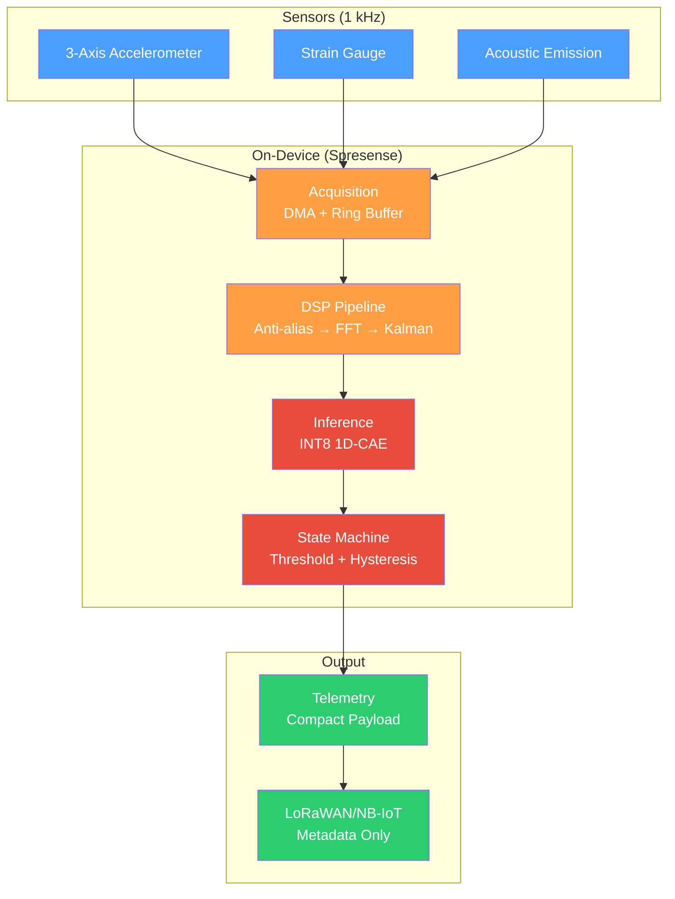

# EdgeSeisFusion

**Extreme-edge autonomous structural health monitoring for aging Japanese civil infrastructure**

EdgeSeisFusion is a decentralized, real-time anomaly detection system that runs entirely on Sony Spresense hardware with no cloud dependency. It fuses multi-modal sensor data (accelerometer, strain, acoustic emission) to detect seismic degradation in bridges, tunnels, and expressways while operating for years on battery/solar power.

## Overview

### What It Does

EdgeSeisFusion performs continuous anomaly detection by:
- **Capturing** multi-modal sensor streams at 1 kHz with deterministic synchronization
- **Processing** raw signals through FFT-based feature extraction and Kalman filtering
- **Scoring** features using a quantized 1D Convolutional Autoencoder trained on healthy baselines
- **Alerting** with hysteresis logic to prevent false positives from seasonal drift and traffic variations
- **Transmitting** only compact anomaly metadata over LoRaWAN/NB-IoT (no raw vibration data)
- **Adapting** conservative baseline estimates to handle long-term operational drift

### Key Constraints

| Resource | Limit | Target Allocation |
|---|---|---|
| **SRAM** | 1.5 MB | Ring buffers (200 KB), DSP workspace (100 KB), tensor arena (600 KB), inference scratch (300 KB) |
| **Flash** | 2 MB | Firmware (800 KB), quantized model (50–80 KB), config/strings (50 KB) |
| **Power** | Battery/solar | <1% duty cycle (45 mW active, 0.5 mW sleep) |
| **Bandwidth** | LoRaWAN | ~4.8 kbps; alerts designed for <30 bytes per transmission |
| **Latency** | Per-window | ~400 ms per second of data (leaves 600 ms for sleep) |

## System Architecture



## Technology Stack

### Offline Development (Training & Validation)
- **Language**: Python 3.9+
- **Signal Processing**: NumPy, SciPy, librosa
- **Machine Learning**: TensorFlow, Keras, scikit-learn
- **Data**: Synthetic generation (physics-based) + public SHM datasets (Mendeley, Zenodo)

### On-Device (Firmware)
- **Runtime**: Sony Spresense SDK (ARM Cortex-M4F @ 156 MHz)
- **Model Inference**: TensorFlow Lite for Microcontrollers (TFLM)
- **DSP**: CMSIS-DSP (FFT, Kalman filtering)
- **Communications**: LoRaWAN driver (with NB-IoT alternative)
- **Language**: Embedded C/C++

### Containerization
- **Offline Build**: Docker with TensorFlow GPU support
- **Firmware Build**: Docker with ARM embedded toolchain

## Project Structure

```
edge-seisfusion/
├── README.md                         # Project overview (this file)
├── ARCHITECTURE.md                   # Detailed technical architecture
├── plan.txt                          # Implementation execution plan
│
├── contracts/                        # Machine-readable specifications
│   ├── resource_budget_contract.v1.json
│   └── tech_stack_profile.v1.json
│
├── docs/                             # Technical documentation
│   ├── resource_budget_contract.v1.md
│   └── tech_stack_lock.v1.md
│
├── datasets/                         # Data generation & ingestion
│   ├── synthetic_gen.py              # Physics-based signal generation
│   ├── public_loader.py              # SHM dataset ingestion + normalization
│   └── synthetic_v1.h5               # Generated synthetic signals
│
├── dsp/                              # Signal processing (offline reference)
│   ├── reference_dsp.py              # FFT + Kalman reference implementation
│   ├── golden_vector_test.py         # Regression test suite
│   └── reference_features.h5         # Computed reference features
│
├── preprocessing/                    # Data windowing & fusion
│   ├── windowing.py                  # Synchronized windows, feature packing
│   └── split.py                      # Train/val/test splits (by structure)
│
├── models/                           # Model training & export
│   ├── train_cae.py                  # 1D-CAE training
│   ├── anomaly_scorer.py             # Threshold & hysteresis tuning
│   ├── quantize_model.py             # INT8 quantization
│   ├── export_tflm.py                # TFLM export
│   └── model_v1.tflite               # Quantized model artifact
│
├── firmware/                         # On-device firmware
│   ├── main.cpp                      # Firmware entry point
│   ├── acquisition.cpp               # Sensor acquisition + DMA
│   ├── dsp_embedded.cpp              # Embedded DSP pipeline
│   ├── inference.cpp                 # TFLM inference integration
│   ├── anomaly_state_machine.cpp     # Alert logic + hysteresis
│   ├── telemetry.cpp                 # Payload encoding
│   ├── models/                       # TFLM artifacts
│   └── config/                       # Configuration parameters
│
├── tests/                            # Validation & regression tests
│   ├── golden_vectors/               # Fixed replay bundle
│   ├── test_dsp_parity.py            # Embedded vs offline DSP comparison
│   ├── test_anomaly_detection.py     # Model detection validation
│   └── test_power_profile.py         # Power measurement suite
│
├── config/                           # Deployment configuration
│   ├── dsp_params.yaml               # FFT, Kalman tuning
│   ├── model_params.yaml             # 1D-CAE architecture
│   └── deployment.yaml               # LoRaWAN credentials
│
├── scripts/                          # Utility scripts
│   ├── run_full_pipeline.sh          # End-to-end offline build
│   ├── flash_firmware.sh             # Compile and flash to Spresense
│   └── replay_golden_vectors.sh      # Regression test runner
│
├── docker/                           # Container definitions
│   ├── Dockerfile.offline            # Python + TensorFlow
│   └── Dockerfile.firmware           # ARM toolchain
│
└── requirements-offline.txt          # Python dependencies
```

## Core Components

### Sensor Acquisition Module
Deterministic multi-channel capture at 1 kHz with DMA buffering:
- Multi-channel sensor initialization (I2C/SPI)
- Fixed-size ring buffers (prevent overruns, track sample loss)
- Deterministic hardware timestamping (<1 µs jitter)
- Buffer diagnostics and sample-loss counters

**Output**: Raw timestamped windows with validated capture metrics.

### DSP Pipeline
Signal processing locked offline, verified on-device:
- Anti-alias FIR filter (400 Hz cutoff for 500 Hz Nyquist)
- FFT extraction (1024 samples → 7 frequency bands per channel)
- Kalman filtering (noise smoothing, baseline tracking)
- Feature normalization (zero-mean, unit variance)

**Output**: Canonical feature tensors [5 channels × 7 bands = 35 features] per 1-second window.

### Anomaly Detection Engine
1D-CAE trained on healthy baseline signals:
- Reconstruction error as anomaly score
- Threshold selection with hysteresis
- Optional OC-SVM for boundary definition
- State machine with cooldown logic to prevent alert spam

**Output**: Boolean anomaly decisions with confidence scores and sensor health flags.

### Telemetry & Uplink
Compact metadata transmission:
- Alert schema: anomaly score, confidence, sensor status, device metadata
- Binary encoding (60–70% smaller than JSON)
- LoRaWAN or NB-IoT driver with retry policy
- Typical alert: ~20 bytes over LoRaWAN

**Output**: Transmitted anomaly events with network status tracking.

### Adaptive Baseline (Optional)
Conservative drift handling:
- Bounded baseline update logic (prevents model erosion)
- Contamination guardrails (rejects anomalous windows)
- Offline validation with non-stationary replay data
- Threshold recalibration within frozen bounds

## Development Workflow

### 1. Offline Development (Laptop/Desktop GPU)

**Generate synthetic data**:
```bash
python -m datasets.synthetic_gen \
  --scenarios healthy_baseline,thermal_drift,micro_fracture \
  --output datasets/synthetic_v1.h5
```

**Build DSP reference**:
```bash
python dsp/reference_dsp.py --input datasets/synthetic_v1.h5 \
  --output dsp/reference_features.h5
```

**Train model**:
```bash
python models/train_cae.py --data dsp/reference_features.h5 \
  --epochs 100 --model-size compact \
  --output models/model_checkpoint_v1.h5
```

**Quantize & export**:
```bash
python models/quantize_model.py --checkpoint models/model_checkpoint_v1.h5 \
  --output models/model_v1.tflite
python models/export_tflm.py --tflite models/model_v1.tflite \
  --output-dir firmware/models
```

### 2. Firmware Development (Spresense Board)

**Build firmware**:
```bash
cd firmware && mkdir build && cd build
cmake .. -DCMAKE_TOOLCHAIN_FILE=../spresense.cmake
make -j4
```

**Flash to Spresense**:
```bash
python spresense_tools/flash_writer.py \
  --bin firmware/build/firmware.bin --port /dev/ttyUSB0
```

### 3. Validation

**Run golden-vector regression tests**:
```bash
python tests/test_dsp_parity.py --golden tests/golden_vectors/
python tests/test_anomaly_detection.py --model models/model_checkpoint_v1.h5 \
  --golden tests/golden_vectors/ --threshold 2.5
```

**Embedded parity testing** (on Spresense):
```bash
./scripts/replay_golden_vectors.sh
```

## Configuration

Key tuning parameters:

| Parameter | File | Purpose |
|---|---|---|
| `fft_size` | `config/dsp_params.yaml` | FFT resolution (1024 for 1 Hz bins @ 1 kHz) |
| `kalman_process_noise` | `config/dsp_params.yaml` | Baseline drift tracking (0.01 typical) |
| `anomaly_threshold` | `config/model_params.yaml` | Reconstruction error cutoff (μ + 2σ typical) |
| `hysteresis_cooldown_sec` | `config/firmware_params.h` | Time between consecutive alerts (300 sec) |
| `tensor_arena_size` | `config/firmware_params.h` | TFLM memory (614 KB to fit in 600 KB budget) |

## Key Design Decisions

| Decision | Rationale |
|---|---|
| **1D-CAE over supervised classification** | Structural failure is rare; one-class anomaly detection better suited. Reconstruction error directly captures deviation from healthy baseline. |
| **Kalman filtering over raw FFT** | Bridges exhibit continuous motion (traffic, wind). Kalman smooths noise and provides trend for drift adaptation. |
| **INT8 quantization (aggressive)** | Model must fit in <50 KB flash; inference in <600 KB SRAM tensor arena. Typically 1–3% AUROC loss. |
| **LoRaWAN metadata-only** | Bandwidth severely constrained. Anomaly score + context sufficient; raw signals impossible to send. |
| **Fixed 1-second windows** | Deterministic latency, aligns with 1 kHz sampling, simplifies DSP. Trade-off: misses very-long-period anomalies (handled by adaptive baseline). |

## Security & Privacy

- **No cloud dependency**: All computation on-device; no telemetry to external services
- **APPI compliance**: Alert payloads contain no PII; only device ID + anomaly event transmitted
- **Data minimization**: Raw vibration data never leaves device; only anomaly metadata sent
- **Model integrity**: CRC32 on quantized weights; firmware rejects corrupted models
- **LoRaWAN security**: Network-level MAC authentication prevents spoofed alerts

## Performance Targets

| Metric | Target | Status |
|---|---|---|
| **Per-window latency** | <500 ms | Budgeted: 400 ms active + 600 ms sleep |
| **Model footprint** | <80 KB (INT8) | Compact 1D-CAE, 50–80 KB typical |
| **False positive rate** | <0.5% under drift | Validated against non-stationary replay |
| **Inference accuracy** | >0.90 AUROC | Measured on held-out anomalies |
| **Power consumption** | <1% duty cycle | 45 mW active, 0.5 mW sleep → multi-year on batteries |
| **Uplink bytes** | <30 bytes/alert | Binary payload encoding |

## Testing Strategy

**Golden-vector regression suite**: Fixed bundle of representative healthy, drifted, and anomalous windows tested across offline and embedded implementations.

**DSP parity validation**: Embedded FFT + Kalman outputs compared against offline reference with <1% error tolerance.

**Model accuracy**: Evaluated on held-out test set with AUROC, F1, and false-positive rate under drift.

**Hardware profiling**: Actual measured latency and memory use on Spresense; Monte Carlo power simulation.

**Reliability demonstration**: Long-duration end-to-end scenario with healthy periods, induced drift, injected anomalies, and network stress.

## Getting Started

### Prerequisites

**Offline development**:
- Python 3.9+, pip
- GPU (NVIDIA CUDA) recommended

**Firmware development**:
- Sony Spresense SDK
- ARM GCC embedded toolchain
- CMake 3.16+

### Quick Start

1. Clone and install:
   ```bash
   git clone <repo_url>
   cd edge-seisfusion
   pip install -r requirements-offline.txt
   ```

2. Generate synthetic data:
   ```bash
   python -m datasets.synthetic_gen --output datasets/synthetic_v1.h5
   ```

3. See `ARCHITECTURE.md` for detailed setup and development instructions.

## References

- **Detailed architecture**: See `ARCHITECTURE.md` for component descriptions, execution flow, failure analysis, and design trade-offs
- **Implementation plan**: See `plan.txt` for structured development roadmap with resource budgets and milestones
- **Resource budget**: See `contracts/resource_budget_contract.v1.json` for hardware constraints and acceptance criteria
- **Proposal**: See `EdgeSeisFusion_Proposa.txt` for project motivation and research objectives
